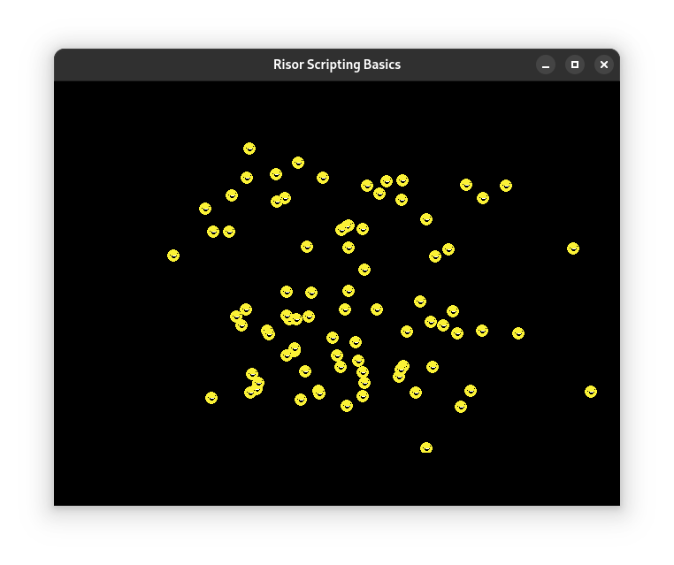

# Risor Scripting Basics

[Risor](https://risor.io/) is a light-weight scripting language that can be embedded into Go applications; this repo serves as a very simple example showcasing using it, primarily in a game, and this readme serves as a sequence of little thoughts about it.

A script running in a Risor VM can interact with Go in a couple of ways (that I've found so far, anyway). One is that you can pass Risor-convertable basic Go types like `int`s or `string`s (or objects that implement Risor's `object.Object` interface) into function calls as arguments, and the other is to make plain Go structs (comprised of objects that, again, Risor can convert between) and their methods available as global values. Struct fields that aren't exported aren't converted, allowing you to hide incompatible data and make "proxy" structs that serve as go-betweens / globally available objects in your scripts.

The example makes use of global Go objects to make it possible to draw *ebiten.Images from scripts.

# How to run the example

Download this repo, unzip it, and run `go run .` from the root. Press Space to spawn smileys. They'll wiggle around as they move off the screen. Don't be alarmed; this is by design.

The script is hot-reloaded when changed, allowing you to easily edit it, save, and see your changes.